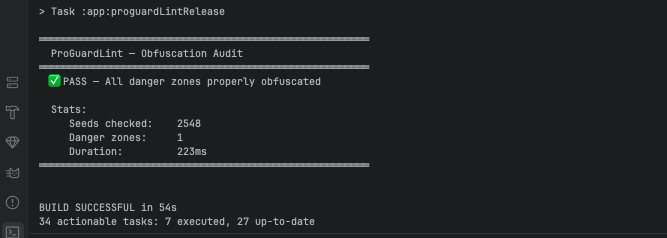

# ProGuardLint

[](https://github.com/rudradave1/proguard-lint/actions/workflows/ci.yml)
[](https://plugins.gradle.org/plugin/io.github.rudradave1.proguardlint)
[](https://opensource.org/licenses/MIT)

ProGuardLint is a high-performance Gradle plugin designed for Android security teams. It audits R8/ProGuard obfuscation compliance by analyzing `mapping.txt` and `seeds.txt` directly.

Unlike traditional decompilation tools (like MobSF) that take minutes and require heavy infrastructure, ProGuardLint runs as a native Gradle task in **under 250ms**.

---

## Key Benefits
- **Lightning Fast:** Runs in <250ms during your release build.
- **CI-Ready:** Fails builds when critical packages are accidentally kept.
- **Zero Overhead:** No APK decompilation, no Docker, no external services.
- **Native Integration:** Uses the Android Gradle Plugin (AGP) Artifacts API.

---

## Example Audit


```text
> Task :app:proguardLintRelease FAILED

  ProGuardLint — 2 violation(s)
  ─────────────────────────────
  com.mycompany.payment.Gatekeeper       danger zone: com.mycompany.payment
  com.mycompany.auth.SessionManager      danger zone: com.mycompany.auth

  FAIL: 2 class(es) in danger zones are not obfuscated.
```

---

## Quick Start

Add the plugin to your `app/build.gradle.kts`:

```kotlin
plugins {
    id("io.github.rudradave1.proguardlint") version "0.1.0"
}

proguardLint {
    dangerZones = listOf("com.mycompany.payment", "com.mycompany.auth")
    failOnError = true
}
```

Run the audit:
```bash
./gradlew proguardLintRelease
```

---

## GitHub Action Integration
Automate your security gate with our GitHub Action:

```yaml
- uses: rudradave1/proguard-lint@v0.1.0
  with:
    danger-zones: "com.mycompany.payment,com.mycompany.auth"
    fail-on-error: "true"
```

The action automatically posts a summary comment on your pull request.

---

## How It Works
1. **R8/ProGuard** emits `mapping.txt` and `seeds.txt` during release builds.
2. **ProGuardLint** reads `seeds.txt` to identify all classes marked with `-keep` rules.
3. It validates kept classes against your configured `dangerZones`.
4. Violations are reported to the console and exported to `proguard-lint-report.json`.

---

## License
This project is licensed under the **MIT License**. See the [LICENSE](LICENSE) file for details.
