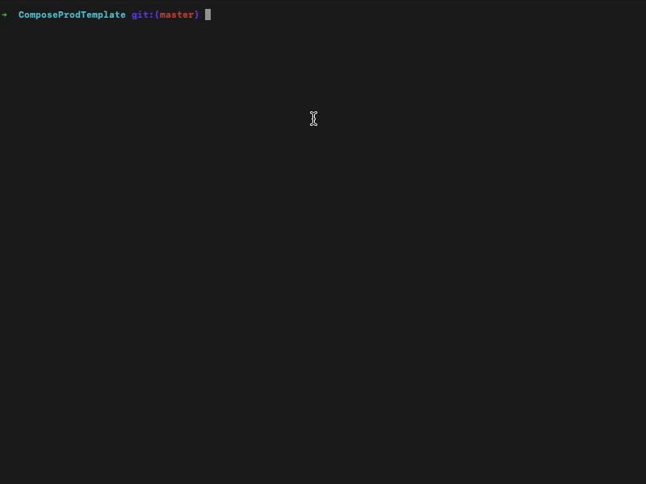

# ProGuardLint

[](https://github.com/rudradave1/proguard-lint/actions/workflows/ci.yml)
[](https://plugins.gradle.org/plugin/io.github.rudradave1.proguardlint)
[](https://opensource.org/licenses/MIT)

Lightning fast Gradle plugin that audits ProGuard/R8 obfuscation quality from mapping.txt and seeds.txt.
No APK, no decompiler, no Docker. Runs in <250ms as part of your release build.

## Screenshot


## Installation

```kotlin
plugins {
    id("io.github.rudradave1.proguardlint") version "0.1.0"
}
```

## Configuration

```kotlin
proguardLint {
    dangerZones = listOf("com.mycompany.payment", "com.mycompany.auth")
    failOnError = true
}
```

Run the audit:
```bash
./gradlew proguardLintRelease
```

## Example Output

```text
> Task :app:proguardLintRelease FAILED

ProGuardLint — 2 violation(s)
─────────────────────────────
com.mycompany.payment.Gatekeeper       danger zone: com.mycompany.payment
com.mycompany.auth.SessionManager      danger zone: com.mycompany.auth

FAIL: 2 class(es) in danger zones were not obfuscated.
```

## Why?
Most tools analyze obfuscation by decompiling the APK, which is slow (2-5 minutes) and heavy.
ProGuardLint is different. It reads the mapping files that R8 already produces. It flags packages that are shipping without obfuscation in under a second.

## Features
- Audits obfuscation using `mapping.txt` and `seeds.txt`
- Runs as part of your Gradle build
- Fails the build when configured packages are not obfuscated
- Generates `proguard-lint-report.json`
- Supports GitHub Actions with PR summaries

## GitHub Actions

```yaml
- uses: rudradave1/proguard-lint@v0.1.0
  with:
    danger-zones: "com.mycompany.payment,com.mycompany.auth"
    fail-on-error: "true"
```

## How It Works
1. R8 emits mapping.txt and seeds.txt after release builds.
2. ProGuardLint reads seeds.txt (the list of classes kept by your -keep rules).
3. If a class in a danger zone was kept, it flags a violation.

No APK is needed. The check runs automatically in proguardLintRelease.

## Compatibility
- AGP 8.0+
- Gradle 8.0+
- Kotlin 1.9+

## License
[MIT License](LICENSE)
